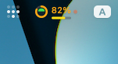

# AILimitCounter

<p align="center">
  
</p>

<p align="center">
  A native system tray app that displays your AI CLI rate limit usage in real time.
  <br>Available for <strong>macOS</strong> (Swift/AppKit) and <strong>Linux</strong> (Rust/KDE Plasma).
</p>

<p align="center">
  
</p>

<p align="center">
  
  
</p>

## Features

- **Multiple AI CLIs** — Switch between Claude Code and Codex from the menu or settings
- **Dual limit visualization** — Custom icon with an outer ring (5h session limit, App Store-style circular progress) and an inner circle (7d weekly limit, fills vertically)
- **Color-coded** — Green (<55%), Yellow (55-69%), Orange (70-84%), Red (85%+)
- **Session percentage** — Shown as text next to the icon with a time-remaining progress bar underneath
- **Live indicator** — Pulsing dot when the selected AI CLI is actively running; auto-increases refresh rate to 1 min
- **Dropdown menu** — Detailed breakdown with colored ASCII bars, reset times, and status
- **Zero config** — Reads your Claude Code OAuth token from keychain automatically

## How It Works

### Claude Code

Makes a minimal API request (`max_tokens: 1`, Haiku model) to `api.anthropic.com` and reads the rate limit headers:

```
anthropic-ratelimit-unified-5h-utilization: 0.32
anthropic-ratelimit-unified-7d-utilization: 0.40
anthropic-ratelimit-unified-5h-reset: 1775523600
anthropic-ratelimit-unified-7d-reset: 1775862000
```

Each check costs ~10 tokens (Haiku).

### Codex

Reads the latest local Codex session event from `~/.codex/sessions` and displays the `rate_limits` payload emitted by Codex. Codex checks are local-only and do not make an API request.

## Install

### Download (recommended)

1. Download the latest `AILimitCounter-v*.zip` from [Releases](https://github.com/Phirios/AILimitCounter/releases)
2. Unzip and move `AILimitCounter.app` to `/Applications`
3. Cache your Claude Code token (one-time):
```bash
security find-generic-password -s "Claude Code-credentials" -w | \
  python3 -c "import sys,json; print(json.loads(sys.stdin.read())['claudeAiOauth']['accessToken'])" \
  > ~/.claude/claude-menubar-token
```
4. Launch the app

> **Note:** macOS may show "unidentified developer" warning on first launch. Right-click the app and select Open, then click Open in the dialog.

### Build from source

```bash
git clone https://github.com/Phirios/AILimitCounter.git
cd AILimitCounter
swift build -c release
```

Then create the app bundle:
```bash
APP="$HOME/Applications/AILimitCounter.app/Contents"
mkdir -p "$APP/MacOS"
cp .build/release/AILimitCounter "$APP/MacOS/"
```

### Launch at login (optional)

```bash
osascript -e 'tell application "System Events" to make login item at end with properties {path:"/Applications/AILimitCounter.app", hidden:false}'
```

## Menu Bar

```
[icon] 32% ●     ← session %, pulsing dot = claude is running
       ▓▓░░░     ← time remaining bar

Click to open:
┌─────────────────────────────────────────────┐
│ ● Claude is running                         │
│─────────────────────────────────────────────│
│ ✅ Allowed                                  │
│─────────────────────────────────────────────│
│ 5h  [██████░░░░░░░░░░░░░░] 32% ◀           │
│       Reset: in 3h 42min                    │
│─────────────────────────────────────────────│
│ 7d  [████████░░░░░░░░░░░░] 40%             │
│       Reset: in 4d 2h                       │
│─────────────────────────────────────────────│
│ Refresh Now                          ⌘R     │
│ Settings...                          ⌘,     │
│─────────────────────────────────────────────│
│ Quit                                 ⌘Q     │
└─────────────────────────────────────────────┘
```

## Requirements

- macOS 14+
- Claude Code CLI (authenticated via `claude auth login`)

---

## Linux (KDE Plasma)

Pure Rust implementation using [ksni](https://github.com/iovxw/ksni) (StatusNotifierItem) and [tiny-skia](https://github.com/RazrFalcon/tiny-skia). No GTK or libappindicator dependency — works on both X11 and Wayland.

### Install dependencies (Arch / CachyOS)

```bash
sudo pacman -S rust dbus
```

### Build

```bash
cd linux
cargo build --release
```

Binary: `linux/target/release/ai-limit-counter`

### Token setup (one-time)

```bash
security find-generic-password -s "Claude Code-credentials" -w 2>/dev/null | \
  python3 -c "import sys,json; print(json.loads(sys.stdin.read())['claudeAiOauth']['accessToken'])" \
  > ~/.claude/claude-menubar-token
```

Or copy from your Mac's `~/.claude/claude-menubar-token`.

### Autostart with KDE

```bash
mkdir -p ~/.config/autostart
cat > ~/.config/autostart/ai-limit-counter.desktop << 'EOF'
[Desktop Entry]
Type=Application
Name=AILimitCounter
Exec=/path/to/ai-limit-counter
Comment=Claude Code rate limit monitor
X-KDE-autostart-phase=2
EOF
```

## License

MIT
